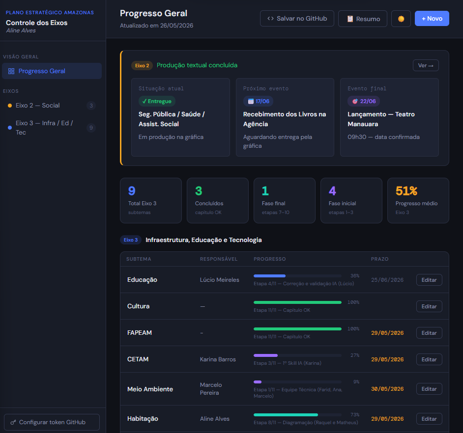
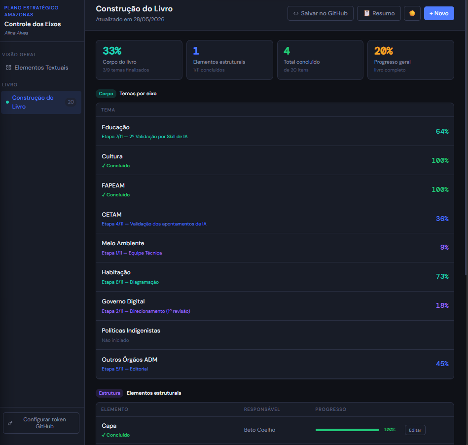

# Plano Estratégico de Desenvolvimento do Amazonas
# Controle dos Eixos — Plano Estratégico de Desenvolvimento do Amazonas

## Sobre o Projeto
Este é um sistema interativo de gestão e monitoramento estratégico desenvolvido para acompanhar, por etapas e subtemas, o processo de construção e produção dos eixos envolvidos no **Plano de Desenvolvimento Estratégico do Amazonas**. 

A ferramenta centraliza o status de produção textual, prazos e responsabilidades, transformando o acompanhamento editorial e técnico em um fluxo visual dinâmico. O grande diferencial é a sua **integração nativa com o GitHub via Token**, permitindo salvar os estados e atualizações diretamente no repositório.

---

## Funcionalidades Principais
- **Linha do Tempo de Eventos:** Destaque para marcos críticos como "Recebimento dos Livros na Agência" e o "Lançamento no Teatro Manauara".
- **Métricas Gerais por Eixo:** Cards com indicadores automáticos de progresso médio, total de subtemas, capítulos concluídos e divisão por fases (inicial vs. final).
- **Acompanhamento de Subtemas:** Tabela detalhada com responsáveis, barras de progresso dinâmicas por etapas (ex: validação, diagramação) e controle rígido de prazos.
- **Sincronização com GitHub:** Botão integrado para salvar o progresso atualizado diretamente na nuvem utilizando autenticação por Token.

---

## Stack Técnica
- **Front-end / Interface:** HTML5, CSS3 (Custom Properties, Dark Mode nativo), JavaScript Assíncrono.
- **Integração:** GitHub REST API (Autenticação via Personal Access Token para persistência de dados).
- **Metodologia:** Gestão de Projetos voltada para Desenvolvimento Regional e Produção Editorial.

---

## Estrutura dos Eixos Monitorados
O painel gerencia o fluxo de produção de grandes eixos estratégicos, divididos em subtemas essenciais:
* **Eixo 2 — Social:** Segurança Pública, Saúde e Assistência Social (Produção textual concluída / Gráfica).
* **Eixo 3 — Infraestrutura, Educação e Tecnologia:** Monitoramento de subtemas como Educação, Cultura, FAPEAM, CETAM, Meio Ambiente e Habitação.

---

## 📸 Demonstração da Interface
> Link para acesso do page: https://euammess.github.io/plano_2027/

Pagina Principal - Elementos Textuais:

Página Principal - Construção do Livro:

> ⚠️ **Nota:** O layout e a estrutura refletem o ecossistema real de gerenciamento do plano, unindo tecnologia e visão estratégica de projetos.

---

## 👩‍💻 Desenvolvido por
**Aline Alves** — Gestora de Projetos & Analista de Dados
- E-mail: `alinemonteiro446work@gmail.com`
